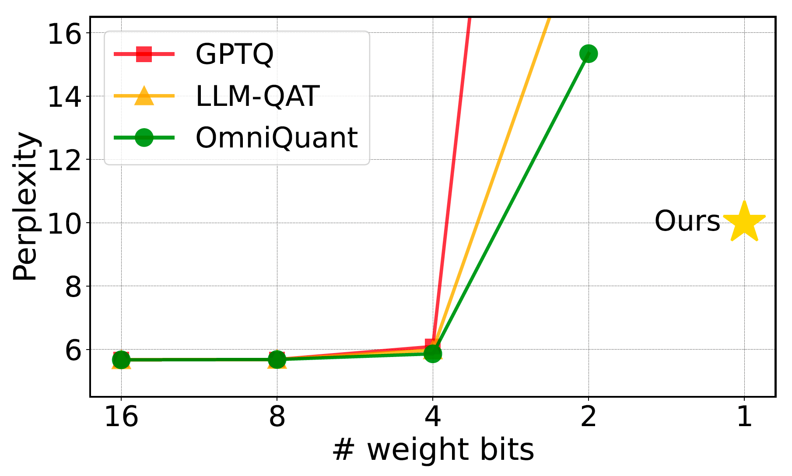

# OneBit: Towards Extremely Low-bit Large Language Models

<div align="center">
  <a href="LICENSE">
    
  </a>
  <a href="https://github.com/xuyuzhuang11/OneBit/commits/main">
    
  </a>
  <a href="https://github.com/xuyuzhuang11/OneBit/pulls">
    
  </a>
  <a href="https://github.com/xuyuzhuang11/OneBit">
    
  </a>
  <br>
  
</div>

<p align="center">
  <br>
  <strong>🔥 The First 1-bit LLM Quantization Method 🔥</strong>
  <br>
  <strong>👍🏻 The SOTA Method of 1-bit LLM Quantization (till 2024.06.20)👍🏻</strong>
  <br>
  <strong>😱 Compressing 90%+ Space yet Maintaining 80%+ Performance 😱</strong>
  <br>
  <strong>🤗 Welcome to Pull Requests and Build our OneBit Model Center 🤗</strong>
  <br>
</p>

<div align="center">
  
</div>

- OneBit Framework is the first 1-bit model quantization method that compressing the fully trained model from high precision format to nearly 1-bit representation.
- OneBit Framework has a novel and efficient 1-bit model architecture for LLMs, which can improve both the time (requiring device support) and space efficiency during model inference. Moreover, this architecture is more stable during quantizing LLMs.
- We want to demonstrate that OneBit is very useful in resource constrained scenarios, such as edge-side devices.

Please refer to our 📃[paper](https://arxiv.org/abs/2402.11295) for more details.

## 📰 News

- [2024/05/20] We released the training code, evaluation code, and data for reproducing our result.

- [2024/02/17] We released the preprint paper to share this OneBit discovery.

## 🏷️ Benchmarks

Please note that due to the use of different checkpoints, the evaluation results listed here have very minor differences from the results in our paper, but this does not affect the existing conclusions.

- LLaMA-7B

| Method | Wiki2 | C4 | Winograde | Hellaswag | PIQA | BoolQ | ARC-e | ARC-c | avg. |
|--------|-------|----|-----------|-----------|------|-------|-------|-------|------|
| FP16 | 5.68 | 7.08 | 66.85 | 72.99 | 77.37 | 73.21 | 52.53 | 41.38 | 64.06 |
| OmniQuant | 15.34 | 26.21 | 52.96 | 43.68 | 62.79 | **58.69** | 41.54 | 29.35 | 48.17 |
| **OneBit** | **10.20** | **11.41** | **58.80** | **51.60** | **67.57** | 56.94 | **42.60** | **30.20** | **51.29** |

- LLaMA-13B

| Method | Wiki2 | C4 | Winograde | Hellaswag | PIQA | BoolQ | ARC-e | ARC-c | avg. |
|--------|-------|----|-----------|-----------|------|-------|-------|-------|------|
| FP16 | 5.09 | 6.61 | 70.17 | 76.24 | 79.05 | 68.47 | 59.85 | 44.54 | 66.39 |
| OmniQuant | 13.43 | 19.33 | 53.83 | 54.16 | 68.99 | 62.20 | **45.50** | 30.38 | 52.51 |
| **OneBit** | **9.19** | **10.26** | **62.12** | **56.75** | **70.35** | **63.82** | 44.57 | **31.83** | **54.91** |

- LLaMA2-7B

| Method | Wiki2 | C4 | Winograde | Hellaswag | PIQA | BoolQ | ARC-e | ARC-c | avg. |
|--------|-------|----|-----------|-----------|------|-------|-------|-------|------|
| FP16 | 5.47 | 6.97 | 67.09 | 72.94 | 76.88 | 71.10 | 53.58 | 40.61 | 63.70 |
| OmniQuant | 31.21 | 64.34 | 51.22 | 33.87 | 56.53 | 59.14 | 33.63 | 24.32 | 43.12 |
| **OneBit** | **9.76** | **11.14** | **58.17** | **52.51** | **67.79** | **63.30** | **41.67** | **29.35** | **52.13** |

- LLaMA2-13B

| Method | Wiki2 | C4 | Winograde | Hellaswag | PIQA | BoolQ | ARC-e | ARC-c | avg. |
|--------|-------|----|-----------|-----------|------|-------|-------|-------|------|
| FP16 | 4.88 | 6.47 | 69.77 | 76.62 | 79.05 | 68.99 | 57.95 | 44.20 | 66.10 |
| OmniQuant | 16.88 | 27.02 | 53.20 | 50.34 | 62.24 | 62.05 | 40.66 | 29.61 | 49.68 |
| **OneBit** | **8.77** | **10.17** | **61.33** | **56.48** | **69.97** | **64.98** | **42.85** | **33.79** | **54.90** |

All the best results are highlighted in bold.

## ⬇️ Installation

Download and install the dependencies to use these codes. You should clone this repository to your local machine, enter the code folder, and install it. We suggest the installation order to be transformers first and llama_factory after. Please note that [Pytorch](https://pytorch.org/) v2.0.0 is required to quantize the models, whereas the evaluation process does not.

```bash
git clone https://github.com/xuyuzhuang11/OneBit.git
cd OneBit/transformers
pip install -e .
cd ../llama_factory
pip install -r ../requirements.txt
```

## 🏁 Quantization

The quantization process can be divided into 3 steps: building an initial checkpoint, training, and packaging. The packaged checkpoint compresses over 90% of the space occupancy and can be used during inference or deployment. We provide the code for this part in the `scripts` folder.

First, you can build an start checkpoint in the following recommended way. The start checkpoint will be saved in `/home/me/OneBit/scripts/start_llama_7b` here and `/home/me/llama_7b` is the path of released model downloaded from Internet. "llama_7b" is a name that you can set freely.

```bash
# example: python scripts/build_start_ckpt.py $NAME $FP16_MODEL_PATH $OUTPUT_CKPT_PATH
python scripts/build_start_ckpt.py llama_7b /home/me/llama_7b /home/me/OneBit/scripts/start_llama_7b
```

Then, you can use the example scripts we provide to complete the model distillation (knowledge transfer) process. Note that the arguments located at the beginning of the script need to be correctly set before running, as follows:

```bash
# arguments
MODEL_NAME=llama_7b
SCRIPT_DIR=$(dirname "$0")              # scripts folder
DATASET=kd_132k                         # our released self-generated data, need not to be modified
TEACHER_MODEL_PATH=/home/xyz/models/llama-7b            # path of FP16 model
STUDENT_MODEL_PATH=$SCRIPT_DIR/ckpt_$MODEL_NAME         # path of intermediate checkpoints to be saved
STUDENT_MODEL_START_PATH=$SCRIPT_DIR/start_$MODEL_NAME  # path of start checkpoint
STUDENT_MODEL_EXIST_PATH=$SCRIPT_DIR/ckpt_$MODEL_NAME/checkpoint-5000   # if you want to continue training process from a intermediate checkpoints

# using slurm to train
sbatch llama_7b.sh
# using bash to train
bash llama_7b.sh
```

Finally, you can perform lossless compression and packaging on the final training checkpoint, which can significantly reduce the runtime space of model inference. Similarly, you need to correctly fill in the checkpoint path at the beginning of the script.

```python
# arguments
ckpt_path = '/home/me/scripts/onebit_llama_7b_trainckpt'       # final training checkpoint
inf_ckpt_path = '/home/me/checkpoints/onebit_llama_7b'         # compressed checkpoint to be saved
```

We also present deepspeed configuration file (for deepspeed) and hostfile (for training models >7B). Please refer to `ds_config.json` and `hostfile`.

## ✅ Evaluation

To facilitate the accurate reproduction of the experimental results presented in our paper and this page, we provide the necessary evaluation code for your reference, which is located in the `evaluation` folder. Users only need to correctly fill in the arguments in the `lm_eval.py` to automatically run the evaluation process and obtain results.

```python
# arguments
args = {
    "multigpu": False,                              # this codes support multigpu evaluation
    "batch_size": 32,                               # larger bsz only for compressed checkpoints :-)
    "net": "onebitllama",                           # need not to be modified for llama
    "model_family": "onebitllama",
    "eval_ppl": True,                               # perform Perplexity evaluation
    "seed": 1234,
    "model": '/home/xyz/checkpoints/onebit_llama_7b',   # path of model checkpoint, important!
    # "tasks": '',
    "tasks": 'hellaswag,winogrande,piqa,boolq,arc_easy,arc_challenge',
    "num_fewshot": 0,                               # Zero-shot Accuracy
    "limit": -1,
}
```

Then, you can run it like:

```bash
cd evaluation
CUDA_VISIBLE_DEVICES=0 python lm_eval.py
```

## ⏩ Add New Models

We warmly welcome friends from around the world to join us in building and researching extremely low-bit LLMs. 🤗🤗🤗Let's build the open-source OneBit LLM center together!🤗🤗🤗 If you need to use the OneBit framework for your own model, you need to define your model in the `transformers` package.

The model folder is `transformers/src/transformers/models`. Our model is in `bitllama`, and you can define your own model architecture as you want, such as `bitcat`, `bitdog`, etc.

If you need to perform efficient inference using compressed checkpoints, you should also define the inference class to recognize the compressed model weights. In our models, these correspond to **BitLlamaForCausalLM** and **BitLlamaForCausalLMInf**, respectively.

Moreover, our core component, the 1-bit linear layer, is located at `transformers/src/transformers/models/bitnet.py`, and you can refer to it for more details.

## 🗞 License

This code and checkpoints are released under the MIT license, allowing you to freely use them within its framework. However, please note not to forget to cite the work as follows.

## ❤️ Citation

If you found this work useful, please consider citing:

```bibtex
@inproceedings{onebit2024xu,
  title={OneBit: Towards Extremely Low-bit Large Language Models},
  author={Xu, Yuzhuang and Han, Xu and Yang, Zonghan and Wang, Shuo and Zhu, Qingfu and Liu, Zhiyuan and Liu, Weidong and Che, Wanxiang},
  booktitle = {Advances in Neural Information Processing Systems},
  year={2024},
  volume = {37},
  pages = {66357--66382},
}
```

## Acknowledgement

Our code is developed based on the [transformers](https://github.com/huggingface/transformers) and [llama_factory](https://github.com/hiyouga/LLaMA-Factory) repositories. We would like to thank them for their very important and meaningful work.😊🤝
